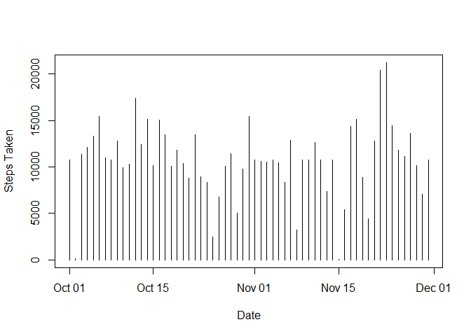

# Reproducible Research: Peer Assessment 1


## Loading and preprocessing the data

```
## Warning: package 'plyr' was built under R version 3.0.3
```

```
## Warning: package 'ggplot2' was built under R version 3.0.3
```


```r
df <-  read.csv(unzip(zipfile = "activity.zip"))
df$date <- as.Date(df$date)
```


## What is mean total number of steps taken per day?

```r
sumDf <- ddply(df,.(date),summarize, sum=sum(steps))
plot(sumDf, xlab='Date',ylab='Steps Taken',type='h')
```

 


## Mean and the median total number of steps taken per day


```r
mean(df$steps,na.rm = TRUE)
```

```
## [1] 37.3826
```

```r
median(df$steps,na.rm = TRUE)
```

```
## [1] 0
```


## What is the average daily activity pattern?


```r
timeSeries <- ddply(df,.(interval),summarize,mean=mean(steps,na.rm = TRUE))
plot(timeSeries,type='l',ylab='Steps Taken')
```

 


## Interval with highest number of steps


```r
timeSeries[which.max(timeSeries$mean),1]
```

```
## [1] 835
```


## Imputing missing values

- Number of Missing values 


```r
sum(is.na(df$steps))
```

```
## [1] 2304
```


- Filling in all the missing values


```r
meanDf <- ddply(df,.(interval),summarize,mean=mean(steps,na.rm = TRUE))
df2 <- merge(df,meanDf,by="interval",sort = TRUE)
```


- Create a new Dataset with missing value filled in


```r
df2[is.na(df2$steps),2] <- df2[is.na(df2$steps),4]
df2 <- df2[with(df2, order(date)),]
df2 <- df2[,c("steps","date","interval")]
```


- New Histogram and Mean & Median


```r
histDf <- ddply(df2,.(date),summarize, sum=sum(steps))
plot(histDf,xlab="Date", ylab="Steps Taken",type="h")
```

 

```r
mean(df2$steps)
```

```
## [1] 37.3826
```

```r
median(df2$steps)
```

```
## [1] 0
```


## Are there differences in activity patterns between weekdays and weekends?
- Creating a factor variable "daytype"


```r
df2$daytype <- ifelse((weekdays(df2$date, abbreviate = FALSE)) %in% c("Saturday","Sunday"), "weekend","weekday")
```


- Make a panel plot containing a time series plot 


```r
aggDf <- ddply(df2,.(daytype,interval),summarize,avg = mean(steps))
qplot(interval,avg,data = aggDf, facets= daytype~.,geom = "line", xlab = "Interval", ylab = "Steps Taken")
```

 
